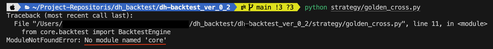
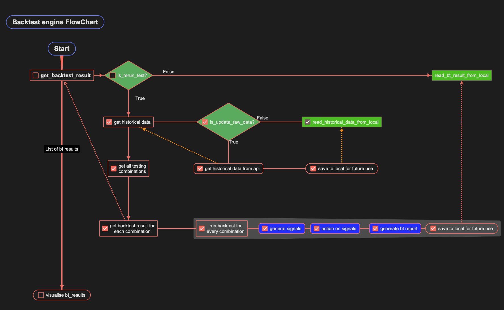
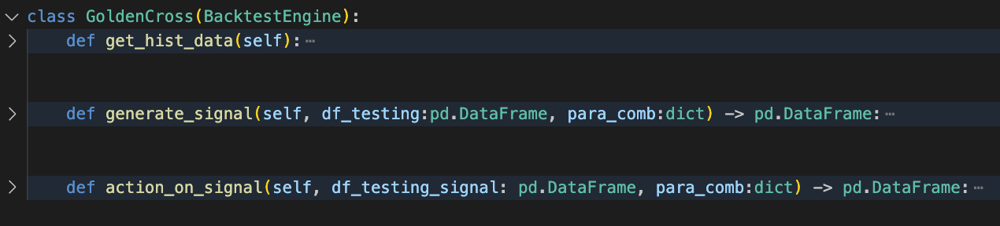

# Introduction

# Table of Contents
 - [Start](#start)
 - [Structure](#structure)
    - [Flowchart](#flowchart)
    - [File structure](#file-structure)
- [Usage](#usage)


# Start
After downloading this package, run below commands in your terminal to build the virtual environment.
```
python3 -m venv .venv
source .venv/bin/activate
pip install -r requirements.txt
```
If you experience error like this,

you may need to run below command below to let the virtual environment know where to look for the core module. <br>
`export PYTHONPATH="/path_to_working_directory/core:$PYTHONPATH"`

# Structure
## Flowchart


## File structure
You should write your trading strategies under folder `/strategy`.  <br> <br>
Strongly recommend setting strategy data folder in below format,    <br>
`/strategy/data/<strategy_name>/`  <br>
 while instantiate BacktestEngine  <br>
`engine = GoldenCross(folder_path= "strategy/data/golden_cross",...)` <br> <br>
While you run backtest, the raw data and backtest results will be stored accordingly. 
```
root: DH-BACKTEST_VER_0_2
|-- core
|    |-- md_pic
|    |-- utilities
|    |-- backtest.py
|    |-- trading_acc.py
|    |-- visualization.py
|
|-- data
|    |-- risk_free_rate
|
|-- strategy
|    |-- data
|    |    |-- <strategy_name>
|    |        |-- bt_results
|    |        |-- raw
|    |
|    |-- <strategy_name>.py
|    |-- <strategy_name>.py
|
|-- .gitignore
|-- requirements.txt

```

# Usage
You need to define your own strategies by makeing a subclass of BacktestEngine, and make your custom functions to generate signals and trade with signals



The historical data DataFrame shall include at least columns,`['datetime', 'trade_date', 'open', 'high', 'low', 'close']` 

